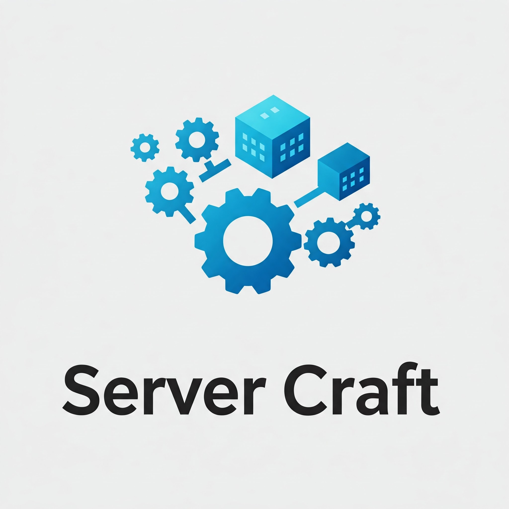

# Server Craft



Preconfigured, composable recipes and utilities to craft your Dockerised server.

## Why

Good software elevates us. 

Thanks to the open source community, there is no shortage of good software. The real challenge is configuring these software and integrate them into a stack that is functional, convenient, and secure. Say, imagine you need to work with some mates to analyse some experiment data. Naturally, you would think about Jupyter Lab or some sorts of business intelligence tool. With container technology, you can spin up an instance of these tools in 5 minutes. But your work does not stop there. How about a nice set of database? Let's throw in a data pipeline as well to move data directly from the bench to the database. What if you want to use domain name rather than IP addresses? What if you want to access everything from Internet? However authentication and authorisation? 

Suddenly, you five-minute adventure becomes days and weeks of fixing configuration and integration. 

*Wouldn't that be nice if you can pick and combine apps to build your software stack, and have all the foundations like reverse proxy, homepage, SSO working automagically?*

**Welcome to Server Craft.**

## How

To realise our vision of compsable server stack that "automagically" work, we need two things:

1. Preconfigured core capabilities such as reverse proxy, dashboard, authentication in a way that can (semi-)automatically detect and configure to work with apps
2. Templates for apps and stacks so that apps can work together and use the core capabilities

To realise the things above, we will rely on familiar tools in the self-hosted community: Docker and Docker Compose. Specifically, we will use Docker to run all of the apps in our server and use Docker's networking facility to link them together. A "server stack" is, thus, a collection of Docker containers configured to work together. To define this collection of Docker containers, we are going to use Docker Compose. To make the collection composable, we are going to use the `include` instruction in Docker Compose.

Here is how Server Craft can help you:

1. We define and maintain a set of foundation stacks that handle core capabiliites like reverse proxy, dashboard, monitoring, DNS, authentication.
2. We provide Docker compose templates for apps to take advantage of the core capabilities by the foundation stacks.
3. We define a set of design rules so that apps can work together in the same stack.

It means with "recipies" inside Server Stack, you can define a new stack for your server simply by including all the necessary apps and stacks defined in this repository and `docker compose up -d` it. With just a few post-deployment configuration, you can have DNS, SSO, tunnels, and other capabilities. 

If an app you need does not exist, you can use the included template to integrate it.


## User Manual

Server Craft is an *opinionated* collection of "recipes" that can be combined to create a software stack for your server. Some recipes describe how a particular *application* (e.g., Jupyter Lab, Metabase, Jellyfin, Langflow, etc.) is configured and deployed. Other recipes describe how applications are combined to form a *substack*, such as data analysis or GenAI applications. Substacks come together to create *stacks* that you can deploy on your server. 

As a **user**, you can manage your server stacks using the `servercraft` CLI. Before you begin, ensure you have:
- Docker Engine and Docker Compose installed.
- Python 3.10 or newer and uv installed.

After cloning this repository, install the CLI dependencies:

```bash
uv sync
```

Run `servercraft --help` to see all available commands. Key commands include:
- `servercraft list-apps`     List all available applications and their descriptions  
- `servercraft list-stacks`   List all existing stacks  
- `servercraft create <NAME>` Scaffold a new stack named `<NAME>`  
- `servercraft start <NAME>`  Start the Docker stack `<NAME>`  
- `servercraft stop <NAME>`   Stop the Docker stack `<NAME>`  
- `servercraft inspect <NAME>` Show configuration, missing variables, and next steps for `<NAME>`  


### Deploy a Stack

Prerequisite: 
- [Docker Engine](https://docs.docker.com/engine/install/) or similar container runtime. This project was tested with Docker.
- [Docker Compose](https://docs.docker.com/compose/install/). This project was not tested with Podman compose.

Process:

``` bash
# clone repository
git clone https://github.com/nguyentran0212/personal-server

# go to stack recipe such as Office-Lab
cd personal-server/Stacks/Office-Lab

# create environment file to configure your stack
cp default.env my-stack.env

# Modify my-stack.env 

# Start the stack with your environment file
./start.sh my-stack.env

# After the stack starts, your apps would be available at <app_domain>.<your_domain> and <app_domain>.localhost
```


### Configure a Stack

Applications in your stack are preconfigured with sensible defaults so that their data is kept between container restarts and they are detected by the reverse proxy out of the box. You can check the recipes in `Apps/`, particularly their `default.env` to see the available environment variables to configure.

**Do not change the configurations directly in the app recipes. Override them within the environment of your stack instead.** This way, you can ensure that all configurations of your stack are packed together in one place, and no unexpected side effects are introduced.

You can configure your stack in two ways:

- Create new `my-stack.env` file and use it to start the stack (`./start.sh my-stack.env`). Any environment variable in my stack would override the corresponding one in substacks and apps.
- Modify `compose.override.yml` to override a part of the recipe of an app that cannot be overriden by environment variable.

Common Environment Variables:

``` bash
# Top level configs
HOME_SERVER_DOMAIN="localhost" # Domain name to access the stack. App would be available as subdomain (e.g., app.localhost)
HOME_SERVER_TZ="Australia/Adelaide" # Timezone code
STACK_NAME="my_stack" # Name of the stack
TRAEFIK_NETWORK="traefik-net" # Name of the network docker compose would create for reverse proxy
```

### Create a stack via CLI

Scaffold a new stack using the `servercraft` command:

```bash
uv run servercraft create my-local-stack
```

This will:
- Copy the Template stack into `Stacks/my-local-stack/`  
- Prompt for your domain, timezone, LAN CIDR, media/work directories  
- Prompt to select a foundation substack (e.g. DNS-TS)  
- Prompt to select apps to include  
- Generate a complete `.env` with auto-generated secrets and `CHANGE_ME` placeholders  

After creation, inspect pending tasks:

```bash
servercraft inspect my-local-stack
```

When ready, start and stop the stack with:

```bash
servercraft start my-local-stack
servercraft stop my-local-stack
```

## Developer Manual

We welcome contributions that introduce new apps and improve the stability and security of the foundation substacks. Please see the roadmap for our "wishlist" of new apps and substacks.

### General Guideline

Prerequisite: 
- [Docker Engine](https://docs.docker.com/engine/install/) or similar container runtime. This project was tested with Docker.
- [Docker Compose](https://docs.docker.com/compose/install/). This project was not tested with Podman compose.
- Familiarity with Docker and Docker Compose
- Familiarity with reverse proxy and Traefik

Process: 
- Fork Server Craft to your GitHub account.
- Write your new App or Substack recipe. The `Apps/Template/` and `Substacks/Template/` provide a starting point to define your new apps and substacks. 
- Please avoid modifying `network`, `extra-hosts`, and `labels` related to Traefik to ensure that the reverse proxy works with your new apps. Other than that, you can define services as you would like, and multiple services can exist within an app. For example, see `Apps/Langflow/compose.yml`. 
- Set the default configuration of your apps using `default.env`
- Integrate into a substack or stack and have a try to ensure everything works on your server.
- Open a pull request to merge your new recipes to Server Craft.

### Known errors / quirks

If a container is connected to two networks (e.g., `traefik-net` and `app-specific-net`), traefik would not be able to reach the container with my current configuration. It seems traefik detects the IP address on the `app-specific-net`, but it tries to direct the traffic via `traefik-net` (or vice versa, neee more investigation). The result is always gateway timeout.

## Product Roadmap

MVP
- [x] Design a mechanism to support recipe composition
- [x] Design reverse proxy mechanism
- [x] Build initial substacks and corresponding apps (Data analysis, media servers, data store, GenAI apps, GenAI tools)
- [x] Build and tested two stacks for demonstration
- [x] User guide
- [x] Developer general guideline
- [ ] Document the general architecture of a stack built on Server Craft
- [ ] Create architecture diagram to explain the design of the recipe composition mechanism

Key enhancement
- [ ] VPN support 
- [ ] Secure tunnel support for accessing from Internet
- [x] Setup LDAP and SSO so that users can login with only one credential
- [ ] Security hardening of the stack
- [ ] Introduce proper secret management in the recipes
- [ ] Introduce backup and restore mechanism to the stack

Wishlist
- [ ] Kubernetes support for multi-host stacks
- [ ] Langfuse integration for GenAI observability
- [ ] Apache airflow integration for data pipeline
- [ ] MinIO integration for persistence
- [ ] LLM inference substack (Ollama or vLLM + an LLM router)
- [ ] Image generation substack (ComfyUI on Nvidia)
- [ ] LLM finetuning substack
- [ ] Stable diffusion finetuning substack
